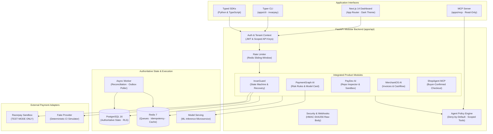

# InvarPay AI

**Invariant-First · Independent · Open-Source · Multi-Tenant · AI-Native Financial Operations Platform**

[](#testing)
[](LICENSE)
[](pyproject.toml)
[](apps/web)
[](apps/api)
[](#security--compliance)

> ⚠️ **Independent open-source project.** Not affiliated with, endorsed by, or a product of Razorpay. The Razorpay adapter operates strictly in **TEST MODE** with sandbox credentials (`rzp_test_*`). All demo transactions and datasets are **SYNTHETIC**.

---

## 🌟 What is InvarPay AI?

**InvarPay AI** is an open-source, invariant-first financial operations platform. It unifies payment reliability, explainable fraud intelligence, automated integration auditing, merchant cashflow analytics, and customer-governed agentic commerce into a single, high-reliability architecture:

| Module | Purpose | Core Capabilities | Status |
|---|---|---|---|
| **InvarGuard** (Reliability) | Payment Lifecycle & Safe Recovery | Lifecycle tracking, raw-body HMAC-SHA256 webhook ingestion, inbox deduplication, deterministic reconciliation, safe retry policy | ✅ Sandbox MVP |
| **PaymentGraph** (Fraud AI) | Explainable Fraud Intelligence | Velocity checks, amount anomaly detection, graph signals, synthetic benchmarks, transparent model card | 🧪 Research prototype |
| **PayDev** (Dev Tools) | Payment Integration Engineer | Static repository inspection, hardcoded secret scanning, float currency detection, proposal-only patch generation | 🧪 Sandbox tooling |
| **MerchantOS** (Finance) | Merchant Financial Assistant | Minor-unit settlement CSV parsing, deterministic matching, cashflow forecasts with assumptions | 🧪 Sandbox tooling |
| **ShopAgent MCP** (Commerce) | Agentic Commerce & Checkout | Authorized merchant catalog browsing, stock validation, strict buyer confirmation gate, provider-hosted checkout handoff | 🧪 Demo workflow |
| **Production SaaS** | Security & Defense-in-Depth | Rate limiting, RLS policy templates, deployment runbooks | ⚠️ Not production-ready |

---

## 🏗️ System Architecture

InvarPay AI is structured as a **modular monolith** with independently deployable async background workers, a Next.js 14 web dashboard, a Model Context Protocol (MCP) server, and a Typer CLI.



---

## 🔒 Invariant-First State Machine

InvarPay enforces strict mathematical state transitions to prevent duplicate charges, phantom authorizations, and desynchronized ledgers:

```
created ──► initiated ──► pending ──► authorized ──► captured (terminal ✓)
                │             │            │
                ▼             ▼            ▼
             failed        failed       failed (terminal ✗)
                │             │
                ▼             ▼
             unknown*      unknown*
                │
                └──────────► cancelled (terminal ⊘)

* unknown = Outcome ambiguous (network timeout, dropped connection).
  CRITICAL INVARIANT: unknown ≠ failed. Automated retry is strictly FORBIDDEN.
```

### Safety Invariants
1. **`unknown ≠ failed`**: Network timeouts or provider 5xx errors transition to `unknown`. Under no circumstances does the system auto-retry an unknown outcome.
2. **Deterministic Reconciliation**: Matching requires provider payment ID, order ID, minor integer units (paise/cents), and currency.
3. **No Float Currency**: Financial calculations use minor integer units (`BIGINT` paise). Floating-point arithmetic is strictly prohibited.
4. **Raw-Body Webhook Verification**: HMAC-SHA256 signatures are computed on the unparsed byte payload before JSON parsing.
5. **Inbox Deduplication & Replay Guard**: Replays outside the 5-minute timestamp window are rejected. Event IDs are deduplicated.
6. **Deny-by-Default Agent Policy**: AI agents (via LangGraph or MCP) are provided read-only tools by default. All mutations require creating an `ApprovalRequest` entity requiring human authorization.
7. **Strict Buyer Confirmation Gate**: ShopAgent never stores card credentials or initiates autonomous purchases. Every order requires explicit customer consent and provider-hosted checkout.
8. **Tenant Isolation**: Every database query enforces `organization_id` matching, backed by PostgreSQL Row-Level Security (RLS).

---

## ⚡ Quick Start

### Prerequisites
- Python 3.10+
- Node.js 20+ & `pnpm`
- Docker & Docker Compose (optional for full services)

### 1. Clone & Set Up Environment
```bash
git clone https://github.com/karthikrshet/InvarPay.git
cd InvarPay

# Copy environment variables
cp .env.example .env
```

### 2. Install Dependencies
```bash
# Python backend & tools
pip install -e .

# Node.js workspace (Next.js web dashboard & TypeScript SDK)
pnpm install
```

### 3. Run the Automated Test Suite (158 Tests)
```bash
# Runs deterministic unit, integration, chaos, security, evaluation, and API-surface tests
python -m pytest tests/ -v
```

### 4. Start the Application
```bash
# Terminal 1: Start FastAPI backend (port 8000)
uvicorn apps.api.app.main:app --reload --port 8000

# Terminal 2: Start Next.js dashboard (port 3000)
pnpm --filter invarpay-web dev
```

- **Dashboard:** [http://localhost:3000](http://localhost:3000)
- **Interactive API Docs (Swagger):** [http://localhost:8000/docs](http://localhost:8000/docs)
- **Health Check:** [http://localhost:8000/health/live](http://localhost:8000/health/live)

---

## 🔁 Safe sandbox payment workflow

The vertical slice tracks a payment attempt; it does not expose a generic charge or capture endpoint.

1. Create an organization with an `owner_password`, then log in to obtain a JWT.
2. Create a test-only provider connection with `POST /v1/provider-connections/test` (credentials are encrypted and never returned).
3. Create an order, then create a local attempt with `POST /v1/orders/{order_id}/payment-attempts` and a unique `Idempotency-Key` header.
4. Configure the Razorpay Test Mode webhook URL as `/v1/webhooks/razorpay/connections/{connection_id}`. The legacy webhook URL refuses ambiguous multi-tenant routing.
5. A verified webhook updates only the matching tenant attempt. An ambiguous outcome remains `unknown` until reconciliation; it never auto-retries.

## 💻 Interfaces & Tools

### Typer CLI (`apps/cli`)
Inspect transactions, trigger reconciliation, and query system health directly from the terminal:
```bash
# Check payment status
invarpay status pay_01HZX87654ABCD1234567890

# Reconcile an ambiguous outcome
invarpay reconcile pay_01HZX87654ABCD1234567890

# Run AI investigation proposal
invarpay investigate pay_01HZX87654ABCD1234567890
```

### Model Context Protocol (MCP) Server (`apps/mcp`)
Exposes read-only tools for AI assistants (Cursor, Claude, Antigravity) following the MCP specification:
- `get_payment_status`
- `reconcile_payment`
- `get_recovery_recommendation`
- `get_risk_assessment`
- `get_audit_trail`

Run via stdio:
```bash
python apps/mcp/server.py
```

### Client SDKs
- **Python Client**: [`packages/sdk-python`](packages/sdk-python)
  ```python
  from invarpay import InvarPayClient
  client = InvarPayClient(api_url="http://localhost:8000", api_key="inv_live_...")
  payment = client.get_payment("pay_01HZX...")
  recovery = client.get_recovery_recommendation("pay_01HZX...")
  ```
- **TypeScript Client**: [`packages/sdk-typescript`](packages/sdk-typescript)
  ```typescript
  import { InvarPayClient } from '@invarpay/sdk'
  const client = new InvarPayClient({ apiUrl: 'http://localhost:8000', apiKey: 'inv_live_...' })
  const payment = await client.getPayment('pay_01HZX...')
  ```

---

## 🧪 Test Suite Architecture

InvarPay AI includes **158 deterministic tests** verifying correctness, safety invariants, and fault tolerance:

| Test Directory | Focus Area | Scenarios Covered |
|---|---|---|
| [`tests/unit/`](tests/unit) | Domain Invariants | State machine transitions, terminal states, minor-unit reconciliation, recovery rules, fraud signals, secret scanners, cashflow projections, buyer confirmation gates |
| [`tests/chaos/`](tests/chaos) | Network & Resilience | Duplicate webhooks, out-of-order delivery, network timeouts, duplicate charge prevention |
| [`tests/security/`](tests/security) | Tenant Isolation | Cross-tenant 404 enforcement, API key scope validation, HMAC-SHA256 signature verification |
| [`tests/integration/`](tests/integration) | Lifecycle Verification | End-to-end payment creation, provider simulation, webhook ingestion, and state matching |
| [`tests/evals/`](tests/evals) | AI Agent Safety | Deny-by-default tool scoping, cross-tenant tool call rejection, prompt-injection boundary isolation, unapproved write blocking |
| [`tests/e2e/`](tests/e2e) | HTTP API Surface | Health endpoints, model cards, rules catalogs, buyer confirmation gate specs |

Run type checks and tests:
```bash
# TypeScript compiler check (0 errors)
npx tsc --noEmit --project apps/web/tsconfig.json

# Pytest test suite (158 passed)
python -m pytest tests/ --no-cov -q
```

---

## 📁 Repository Structure

```
invarpay/
├── apps/
│   ├── api/                  FastAPI modular monolith backend
│   │   ├── app/core/         Auth, database, security, idempotency, rate limiting
│   │   ├── app/models/       27 SQLAlchemy authoritative entity models
│   │   ├── app/routers/      REST API endpoints for all 5 modules
│   │   └── app/agents/       LangGraph agents & deny-by-default policy engine
│   ├── web/                  Next.js 14 App Router dashboard (dark glassmorphism)
│   ├── worker/               Async background workers (reconciliation & events)
│   ├── cli/                  Typer CLI with rich terminal tables (invarpay)
│   └── mcp/                  Model Context Protocol (MCP) server
├── modules/
│   ├── payguard/             Core payment state machine, reconciler, safe recovery
│   ├── paymentgraph/         Deterministic fraud rules & risk assessments
│   ├── paydev/               Static repo analyzer & secret scanner
│   ├── merchantos/           Settlement CSV parser & cashflow projections
│   ├── shopagent/            Catalog, inventory validation & buyer gate
│   └── invarpay/             Top-level invariant module facade
├── packages/
│   ├── contracts/            OpenAPI 3.1 schema & JSON event contracts
│   ├── sdk-python/           Typed Python client library (invarpay-sdk)
│   ├── sdk-typescript/       Typed TypeScript client library (@invarpay/sdk)
│   └── ui/                   Shared UI design tokens & utilities (@invarpay/ui)
├── integrations/
│   └── providers/
│       ├── fake/             Deterministic synthetic CI test adapter
│       └── razorpay_test/    Official Razorpay adapter (TEST MODE only)
├── services/
│   └── model-serving/        PaymentGraph ML inference microservice
├── infra/
│   ├── docker/               Docker Compose dev stack (Postgres 16, Redis 7)
│   └── postgres/             PostgreSQL Row-Level Security (RLS) policies
├── docs/
│   ├── architecture/         State machine, ADRs, provider capability matrix
│   ├── product/              PRD and phase roadmap
│   ├── operations/           Production hardening checklist
│   └── security/             STRIDE threat model
└── tests/                    155 unit, integration, chaos, security, evals, e2e tests
```

---

## ⚖️ Security & Compliance Disclosures

- **PCI-DSS Compliance Boundary**: InvarPay AI does not process, transmit, or store unencrypted Primary Account Numbers (PAN), CVVs, or UPI PINs. Checkout is hosted by authorized providers.
- **Razorpay Sandbox Restriction**: The Razorpay integration is strictly restricted to test keys (`rzp_test_*`). Live production credentials are rejected.
- **Synthetic Data**: All demo merchants, transaction figures, customer names, and benchmark datasets are synthetic fixtures.
- **Model Card Disclosure**: PaymentGraph risk scores are heuristic research prototypes. Real-world deployment requires qualified compliance review and merchant calibration.
- **Release boundary**: Passing local tests does not establish PCI-DSS compliance, production readiness, live-provider certification, legal suitability, or fraud-prevention efficacy. Run migrations, configure PostgreSQL RLS with tenant session context, complete external security review, and obtain provider/compliance approval before any live-money use.

---

## 📄 License

This project is licensed under the [MIT License](LICENSE).
